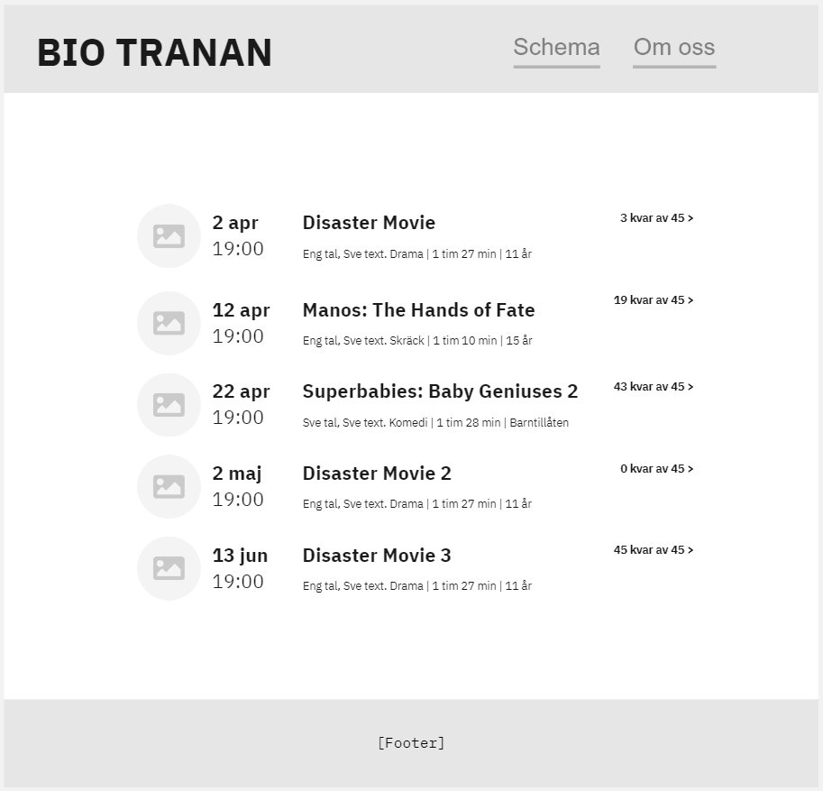
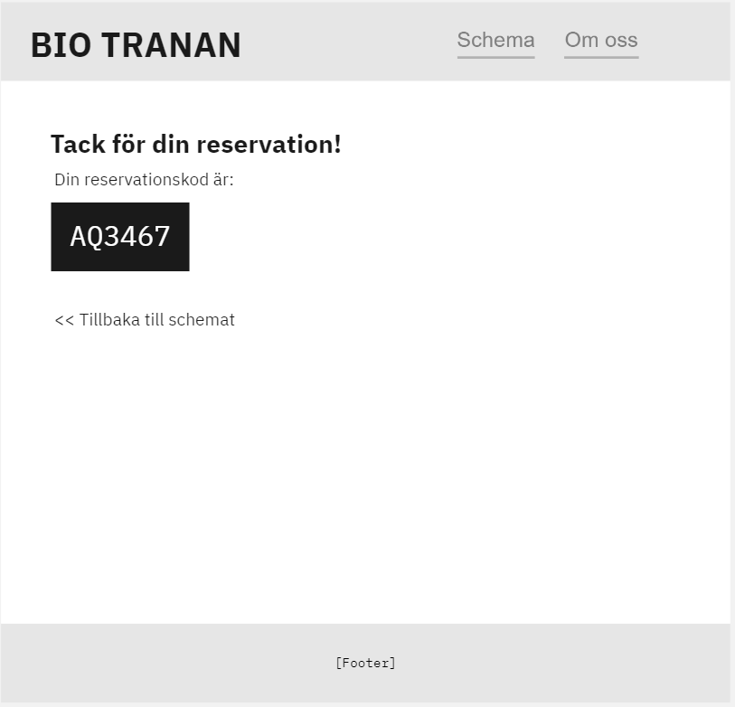

# BioTranan

Obligatorisk **självständig** inlämningsuppgift för BY-SUVNET OOP2

### Inlämning: 3 april kl 09.00

Obligatoriskt kodgenomgång kommer att ske individuellt 3e, 4e och 5e April.
Kodgenomgången fokuserar på en eller flera frågor i stil med:

- Vad finns det för för- och nackdelar med den projekttyp du valt?
- Beskriv hur API-funktion X fungerar från början till slut
- Beskriv hur systemregel Y är implementerad

### Betygskriterier

För G

- Asp.Net Core, EF Core och SQLite används
- Minst 3 av 3 krav för hemsidan
- Minst 6 av 9 krav för REST-APIet
- Minst 2 av 3 systemregler
- Gått igenom "Checklista för inlämning" längst ner i detta dokument

För VG

- Viktigare med en övergripande bra struktur på koden
- Samtliga G-krav
- Minst 5 av 7 extrakrav
- God felhantering av data
- Hantering av eventuellt nyinkomna kravspecändringar

**OBS!** Läs också textfilen TESTNING.md! Dessa krav behövs för att få godkänt i kursen Testning.

**Viktigt!** Se till att kryssa i alla krav du lyckats med. Sätt bara ett x innanför [ ] i denna readmefil så bockas de i.

---

## Uppgiftsbeskrivning

Du har fått i uppdrag att ta fram Bio Tranans nya hemsida! Bio Tranan är en liten ideelt driven biograf som visar ett mindre antal filmer. De har två salonger där de kan visa filmer.

Bio Tranan vill ha två saker, dels en publik hemsida där besökare skall kunna:

- [x] Se schemat för kommande filmvisningar
- [x] Få grundläggande information om filmerna som ska visas
- [x] Reservera platser på filmvisning

Utöver detta vill Bio Tranan, som drivs av erfarna utvecklare, ha ett REST API som kan fungera som administationsverktyg (i framtiden tänkte de skriva sin egen frontend för detta). REST API:et skall kunna:

- [x] Lägga till nya filmer som skall kunna visas
- [x] Ta bort filmer
- [x] Hämta en lista på tillgängliga filmer (Detta är alltså inte samma som att visa schemat för visningar!)
- [x] Lägga till nya salonger med ett visst antal platser
- [x] Uppdatera och ta bort salongsinformation
- [x] Lägga till nya visningar
- [x] Hämta alla **kommande** visningar
- [x] Lista alla reservationer
- [x] Lista alla reservationer för en viss visning

Regler för systemet:

- [x] En film får bara visas ett visst antal gånger. Det skall alltså inte gå att lägga till en film i schemat för visningar, om den redan visats max antal gånger. Detta värde sätts när en film läggs till i databasen första gången.
- [x] Det ska inte gå att lägga till en filmvisning i schemat samma tid som en annan film visas i samma salong
- [x] Det skall inte gå att reservera platser på en visning om det inte finns tillräckligt många platser kvar

## Utöver dessa krav finns några extra VG-krav

Hemsidan:

- [x] Visa det totala priset innan reservationen läggs (se bild)
- [x] Det skall gå att avboka en reservation på valfritt sätt
- [x] Använd ett externt api till något på hemsidan, exempelvis ett random advice från https://api.adviceslip.com/, eller mer avancerat: https://developers.themoviedb.org/3/getting-started/introduction
- [ ] Reviews! Det skall gå att poängsätta filmer samt ge dem ett skriftligt omdöme genom att ange sin reservationskod, men bara efter att filmen visats.

REST-API

- [x] Skapa en ny reservation
- [x] Det skall gå att lägga tillfälliga platsrestriktioner på en viss visning, utifall det blir nya pandemi-regler i framtiden
- [ ] Kräv autentisering för att kunna användas (Valfri metod)
- [x] "Checka in" en reservationskod och sätt den som använd (Kommer att användas vid betalning)

Regler för systemet:

- [ ] Reservationer som är äldre än ett år skall automatiskt tas bort ur databasen.

## Systemet

Hur du väljer att strukturera denna uppgift är upp till dig, men du måste givetvis använda ASP.Net. Exempel:

- Monolitisk applikation i MVC, med REST API:et i samma projekt.
- Blazor WASM som frontend och ett enda REST API som backend
- Blazor Server med frontend-specifik funktionalitet och ett separat REST API specifikt för admins.

## Databas

Använd SQLite i ditt projekt som du comittar. Du kan använda InMemory och seeding under tiden du utvecklar, men i projektet du skickar in skall SQLite användas.

## Tips

- **Angrip projektet lugnt och metodiskt! Gör inte allt på en och samma gång!**
- Läs kravspecen och analysera vilka objekt du kommer behöva. Minns våra tidigare övningar där vi analyserade vilka substantiv och verb som fanns med i beskrivningarna.
- Det är ok att ni skapar extra endpoints och klasser än de som finns beskrivna här, men detta är nuvarande minimumkrav
- Se det här mer som ett uppdrag från en kund istället för ett inlämningsuppgift. Var inte rädd för att ställa frågor, komma med alternativa lösningsförslag om du tycker det skulle göra projektet bättre eller be om förklaringar till varför saker ska fungera enligt kravspecen.
- Tänk på att kunden må vara en van beställare av datasystem, men kraven kan ändå vara lite otydligt formulerade. Det går att ställa öppna förtydligande frågor i Fråge-kanalen på Discord!
- Testning är inte en del av denna kurs, men om du börjar känna dig lite mer bekväm med det så är det inte dumt att implementera tester i detta projekt.

## Checklista för inlämning

- [x] Jag har tagit bort onödig/oanvänd kod
- [x] Jag har tagit bort onödiga kommentarer
- [x] Jag har formaterat min kod fint
- [x] Jag har förstått vad min kod gör (mer eller mindre). Prova att försöka förklara högt för dig själv vad din kod gör. Ställ frågor som "Hur går det till när jag lägger till en film?" "Vad händer om jag försöker reservera 2000 biljetter på en visning?"
- [x] Jag har checkat av vilka funktionskrav jag anser att jag klarat genom att skrivaa ett x innanför [ ] i denna readmefil

